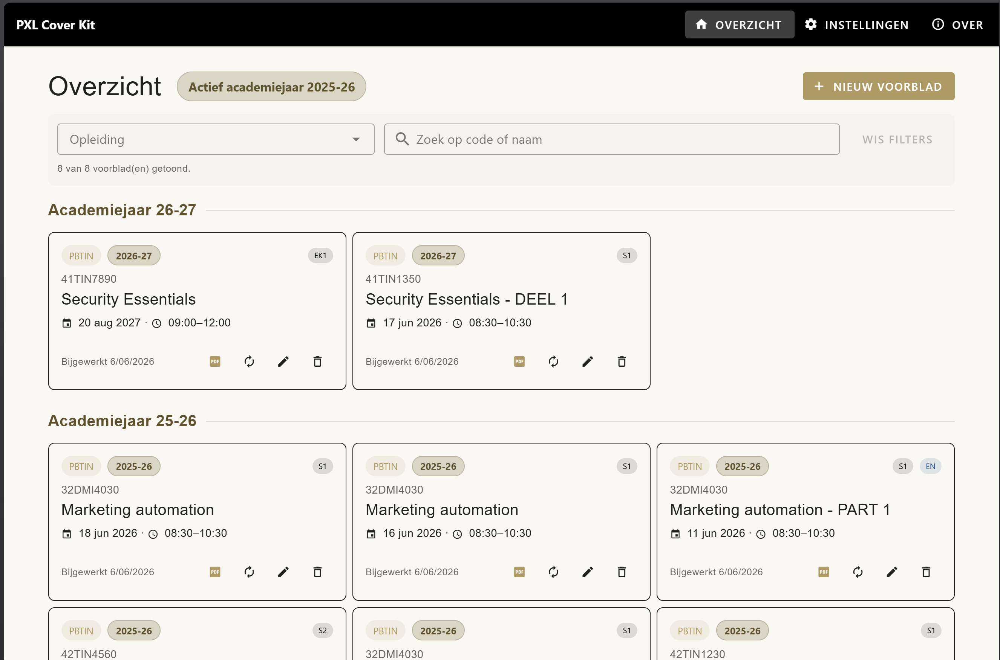
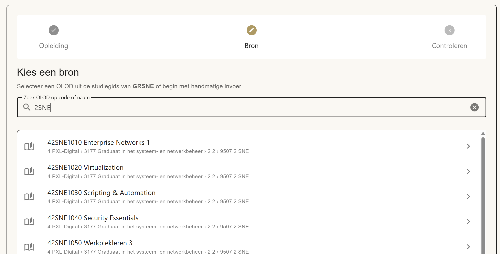
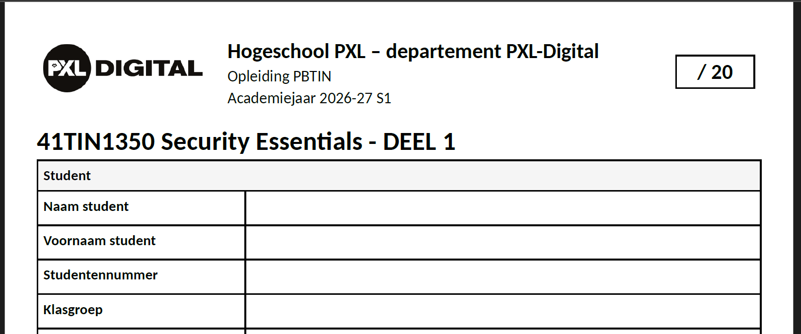

# PXL Cover Kit

Maak in een paar klikken nette, uniforme **examenvoorbladen** voor Hogeschool PXL – departement PXL-Digital. Geen DOCX-sjablonen meer bewerken: vul de gegevens in en download een kant-en-klaar PDF.

**▶️ Open de app:** <https://tomcoolpxl.github.io/pxl-coverkit/#>



---

## Wat doet het?

De app draait volledig in je browser — er is geen server en je data blijft op je eigen toestel. Je kiest een vak uit de PXL-studiegids (of voert er zelf één in), vult de examengegevens aan, en genereert direct een tweepagina A4-voorblad in de officiële PXL-Digital-huisstijl.

## Belangrijkste functies

- **Snel aanmaken** — prefill van opleiding, vakcode en vaknaam uit de studiegids, of handmatige invoer.
- **Lokaal & privé** — alle voorbladen worden bewaard in je browser (localStorage); niets wordt geüpload.
- **Actualiseren** — rol een bestaand voorblad door naar een volgend academiejaar met een nieuwe datum en tijd.
- **PDF offline** — genereer in de browser een perfect opgemaakt voorblad met voorspelbare bestandsnaam.
- **Nederlands & Engels** — schakel per voorblad tussen een NL- en EN-versie.
- **Import / export** — back-up je voorbladen en lectoren als JSON en zet ze over naar een andere browser of computer.

## Zo werkt het

1. Klik op **Nieuw voorblad**.
2. Kies je **opleiding** en zoek het vak (OLOD) in de studiegids — of kies handmatige invoer.
3. Controleer de gegevens, vul examendatum, tijd en hulpmiddelen aan.
4. Sla op en **download de PDF**.



## Het resultaat

Een verzorgd, uniform examenvoorblad — klaar om te printen of digitaal te verspreiden.



📄 **Bekijk een voorbeeld:** [Security Essentials — Examenvoorblad (PDF)](examples/41TIN1350_Security_Essentials_2425_Examenvoorblad_S2.pdf)

## Studiegidsdata

De studiegidsdata zit ingebakken in de app als statische bestanden: telkens drie academiejaren (vorig, huidig, volgend). Er is geen live ophalen uit `studiegids.pxl.be` — een statische site kan dat niet rechtstreeks. Beheerders vernieuwen de data offline; het seedformaat en de beheerstappen staan in [`ARCHITECTURE.md`](ARCHITECTURE.md).

## Lokaal draaien

Gebouwd met Vue 3, TypeScript, Vite, Vuetify 3 en pdfmake.

```bash
npm install
npm start        # ontwikkelserver
npm test         # tests
npm run build    # productiebuild
```
